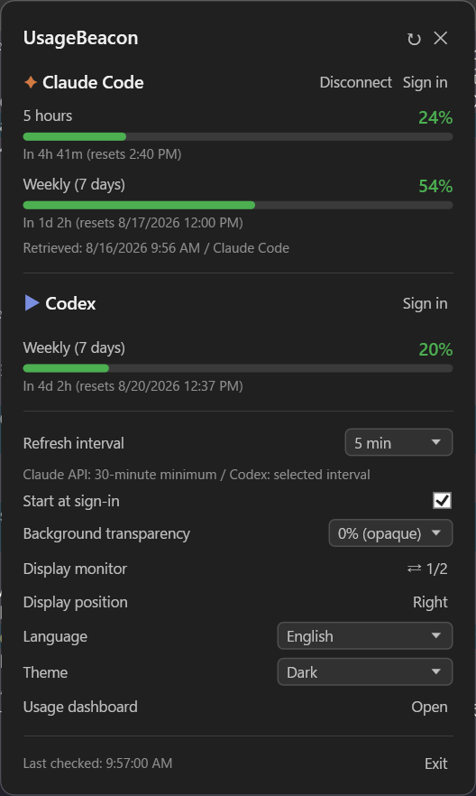
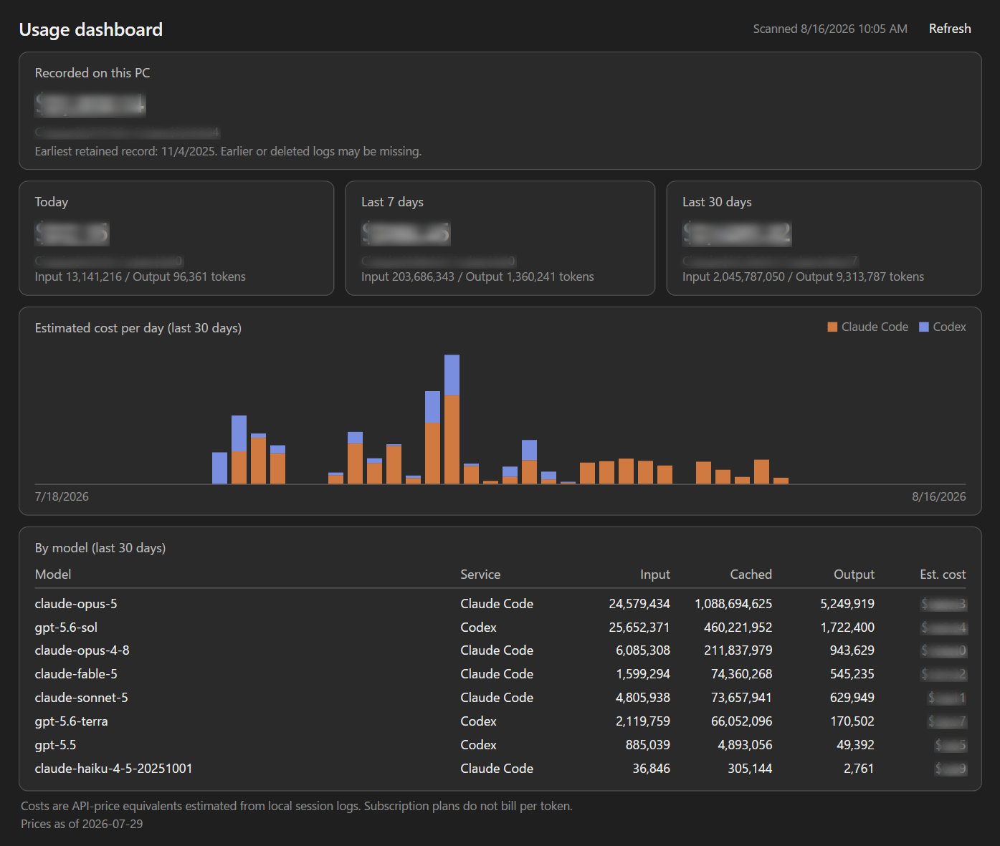

<div align="center">

# UsageBeacon

*Keep Claude Code and Codex usage on your Windows taskbar*

[](https://github.com/kmch4n/UsageBeacon/actions/workflows/ci.yml)
[](https://github.com/kmch4n/UsageBeacon/releases/latest)
[](#requirements)
[](https://dotnet.microsoft.com/download/dotnet/8.0)
[](LICENSE)

[Features](#features) • [Install](#install) • [Usage](#usage) • [Dashboard](#usage-dashboard) • [Privacy](#data-and-privacy)



</div>

UsageBeacon is a lightweight Windows app that keeps your Claude Code and Codex usage where you can
actually see it. A small widget sits on the taskbar; clicking it opens a popup with the five-hour and
weekly windows, reset countdowns, manual refresh, and local settings. A separate dashboard estimates
what that usage would have cost at API prices.

> [!IMPORTANT]
> UsageBeacon is an independent, unofficial community fork of
> [satonico/Token-Checker-win](https://github.com/satonico/Token-Checker-win). It is not affiliated
> with or endorsed by the upstream maintainer, Anthropic, or OpenAI. The fork exists to continue
> Windows-focused maintenance while preserving clear credit for the original work.

## Features

- **Always-visible taskbar widget** with Claude Code and Codex utilization at a glance
- **Detailed usage windows** — five-hour and weekly limits with reset countdowns
- **Native Claude Code integration** that reads rate limits from the status line, with no extra usage API requests
- **Usage dashboard** estimating API-price-equivalent costs from your local session logs
- **English and Japanese** interface, switchable at runtime, following your Windows language by default
- **Light, dark, and system themes**, with adjustable popup transparency
- **Credential discovery** for Windows and WSL Claude installs, and for Codex CLI including nvm-windows
- **Multi-monitor and virtual desktop** aware placement
- **Optional startup registration** and configurable polling intervals
- **Local caching** that keeps the last successful values visible during transient failures
- **No telemetry** — nothing is sent anywhere except the provider requests required to read your usage

Claude Code and Codex are both optional; either one can be used on its own.

## Screenshots

The widget stays on the taskbar and updates on your chosen interval:


The dashboard estimates costs for today, the last 7 days, and the last 30 days, with a daily chart
and a per-model breakdown:



> [!NOTE]
> Dollar amounts are blurred in the screenshot above. They are real values from the author's machine,
> not a limitation of the app.

## Requirements

- Windows 10 or Windows 11, 64-bit
- [Claude Code CLI](https://claude.com/claude-code) signed in with `claude auth login`, for Claude usage
- [Codex CLI](https://developers.openai.com/codex/cli) signed in with `codex login`, for Codex usage

The prebuilt executable is self-contained and does not need a separate .NET installation. Building
from source requires the [.NET 8 SDK](https://dotnet.microsoft.com/download/dotnet/8.0).

## Install

### Download a release

Download `UsageBeacon.exe` from the [Releases page](https://github.com/kmch4n/UsageBeacon/releases)
and run it. No installer, no setup wizard.

Every release is built by GitHub Actions from the tagged source and ships with a SHA-256 checksum.
Verify your download before running it:

```powershell
Get-FileHash .\UsageBeacon.exe -Algorithm SHA256
```

Compare the result with `UsageBeacon.exe.sha256` on the release page.

> [!WARNING]
> The executable is unsigned, so Windows SmartScreen will warn about it. Review the release source and
> verify the checksum before choosing **More info** → **Run anyway**. If you would rather not run an
> unsigned download, build from source instead.

### Build from source

```powershell
git clone https://github.com/kmch4n/UsageBeacon.git
cd UsageBeacon
dotnet build UsageBeacon.sln -c Release
```

The application is written to `UsageBeacon\bin\Release\net8.0-windows\UsageBeacon.exe`.

To produce the same self-contained, single-file build that releases ship:

```powershell
dotnet publish UsageBeacon\UsageBeacon.csproj -c Release -r win-x64 --self-contained true -p:PublishSingleFile=true -p:IncludeNativeLibrariesForSelfExtract=true -o publish\
```

## Usage

Sign in to the CLIs you want to monitor, then start `UsageBeacon.exe`:

```powershell
claude auth login
codex login
```

- Click the taskbar widget to open the usage popup
- Use the tray menu for refresh, monitor switching, and exit
- Adjust refresh interval, transparency, monitor, position, language, and theme from the popup

### Claude Code integration

For more reliable Claude updates, select the integration button next to **Claude Code** in the popup.
UsageBeacon then receives native rate-limit values from Claude Code itself, preserving any status line
command you already have.

> [!TIP]
> The integration needs no extra usage API requests, so it avoids the rate limits that apply to
> Anthropic's OAuth usage endpoint. See [Claude usage retrieval](docs/CLAUDE_USAGE.md) for the full
> behavior, privacy, and fallback details.

### Claude Code in WSL

If Claude Code is installed only inside WSL, open the login window and select **WSL**. UsageBeacon
launches `claude auth login` in an interactive WSL shell and then discovers the credential file from
the WSL filesystem.

### Language and theme

Choose **System default**, **English**, or **Japanese** from the language setting in the popup.
Changes apply immediately to open windows and the tray menu, and unsupported system languages fall
back to English. The theme setting offers **System**, **Light**, and **Dark**.

## Usage dashboard

Open the dashboard from the popup or the tray menu. It parses the session logs that Claude Code and
Codex already write locally (`~/.claude/projects` and `~/.codex/sessions`), prices them against an
embedded per-model table, and reports estimated costs for today, the last 7 days, and the last 30
days, plus a lifetime total split between Claude and Codex.

> [!NOTE]
> These are API-price equivalents, not bills. Subscription plans do not charge per token. The
> lifetime figure covers only what UsageBeacon has retained on this computer, so logs deleted before
> a scan can leave gaps.

See [the dashboard documentation](docs/DASHBOARD.md) for data sources, retention, and price overrides.

## Data and privacy

- Claude credentials are read locally from Windows Credential Manager, known Claude credential files,
  or WSL. OAuth credentials are sent only to Anthropic's token and usage endpoints.
- The optional Claude Code bridge stores only rate-limit percentages, reset times, source, and
  observation time. Other status line session metadata is discarded.
- Codex usage is read through the locally installed `codex app-server`. The Codex access token is
  never parsed or stored.
- Settings and usage caches live in `%APPDATA%\UsageBeacon`. The dashboard parse cache, the optional
  price override, and crash logs live in `%LOCALAPPDATA%\UsageBeacon`.
- There is no telemetry and no analytics. Unhandled exceptions go only to
  `%LOCALAPPDATA%\UsageBeacon\logs\crash.log`, a size-capped local file that is never transmitted and
  is redacted for your profile path, account name, and credential-shaped values.

When upgrading from Token Checker for Windows, UsageBeacon migrates `%APPDATA%\TokenChecker` and the
legacy startup entry automatically. If migration is blocked, it keeps using the existing data
directory rather than discarding your settings.

## Uninstall

Disable Claude Code integration from the popup if you enabled it, then exit UsageBeacon and remove its
startup entries and local data:

```powershell
Stop-Process -Name UsageBeacon -Force -ErrorAction SilentlyContinue
reg delete "HKCU\SOFTWARE\Microsoft\Windows\CurrentVersion\Run" /v UsageBeacon /f 2>$null
reg delete "HKCU\SOFTWARE\Microsoft\Windows\CurrentVersion\Run" /v TokenChecker /f 2>$null
Remove-Item "$env:APPDATA\UsageBeacon" -Recurse -Force -ErrorAction SilentlyContinue
Remove-Item "$env:APPDATA\TokenChecker" -Recurse -Force -ErrorAction SilentlyContinue
Remove-Item "$env:LOCALAPPDATA\UsageBeacon" -Recurse -Force -ErrorAction SilentlyContinue
```

Delete the downloaded executable or cloned repository afterward. Claude and Codex credentials are
managed by their own CLIs and are not removed by these steps.

## Documentation

| Document | Contents |
| --- | --- |
| [Claude usage retrieval](docs/CLAUDE_USAGE.md) | Status line integration, OAuth fallback, and credential handling |
| [Usage dashboard](docs/DASHBOARD.md) | Log parsing, pricing, retention, and overrides |
| [Localization](docs/LOCALIZATION.md) | Resource files and adding a language |
| [Contributing](docs/CONTRIBUTING.md) | Development workflow and pull request expectations |
| [Release procedure](docs/RELEASE.md) | Tagging and the release workflow |
| [Security policy](docs/SECURITY.md) | Reporting vulnerabilities |
| [Changelog](docs/CHANGELOG.md) | Notable changes per release |
| [Attribution notice](docs/NOTICE.md) | Upstream credit and fork history |

## Attribution

UsageBeacon is based on [Token Checker for Windows](https://github.com/satonico/Token-Checker-win) by
satonico224, which ports the macOS [Token Checker](https://github.com/satonico/Token-Checker)
experience to Windows. The original copyright notice and MIT License are preserved in
[LICENSE](LICENSE), with further detail in [NOTICE](docs/NOTICE.md).

The UsageBeacon maintainers are grateful for the upstream design and implementation. References to
the upstream projects are for attribution and history only and do not imply endorsement of this fork.

## Disclaimer

UsageBeacon is provided **as is**, without warranty. Usage data may be delayed, incomplete, or
affected by changes to third-party CLIs and APIs. You are responsible for reviewing the software and
protecting your credentials before use.
